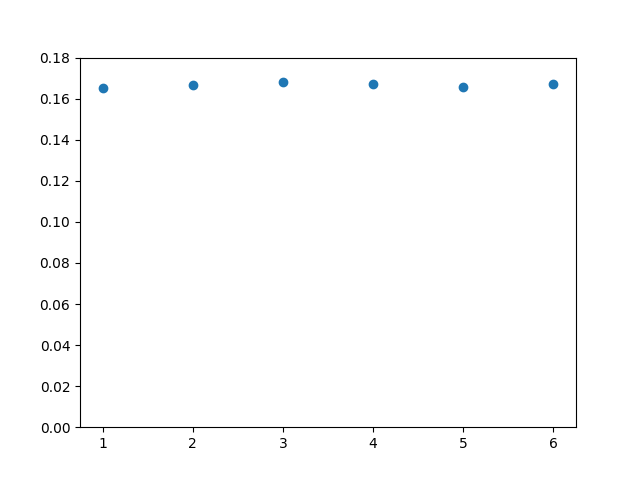
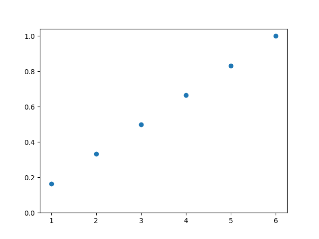
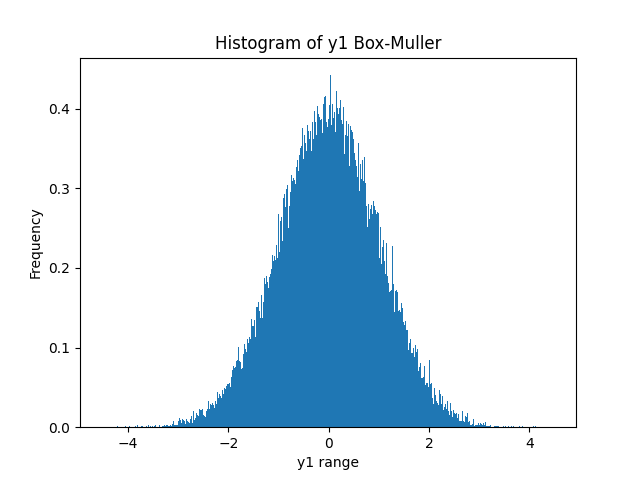
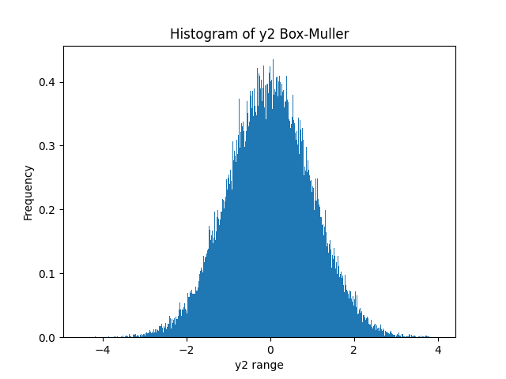
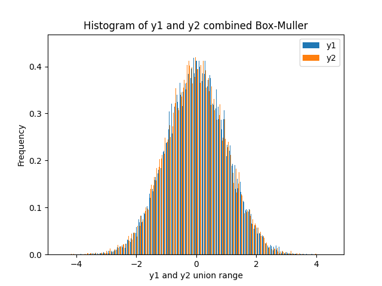
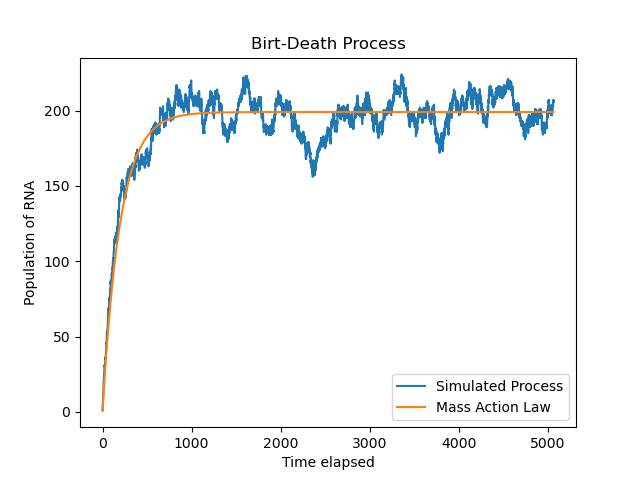

# Assignment -2 

*I did the assignment in Mathematica but the ASU Citrix receiver is not respondig and as a result I have lost my Mathematica notebook. So in quick response I did the whole assignment in Mathematica. Sorry for the trouble, it was beyond my control.*

### Q1- Fair dice roll.

Probability of getting any number in a fair dice roll is same which is also reflected in the graph. Also we expect the CDF to be 1 as well and we obtained the same result. Hence our simulation was successful.

- ###### Probability of getting 1,2 ... 6 in a dice roll can be found in diceProb.png

- ###### CDF of the dice roll can be found in diceCDF.png

### Q2 - Box-Muller Algorithm:

As can be seen from the histogram plot the mean is around 0 and almost 95.5% of the area is within 2 to -2 representing 2 sigma width. Within 3 to -3 equivalent to 3 sigma the whole graph is present. Hence our code is giving correct results.

- ###### The plot of the 1st sequence generated using Box-Muller is in y1.png file.

- ###### 2nd sequence plot is in y2.png file.

- ###### Both plotted together in y-combined.png file.

### Q3 - Mass Action formula:

Solving the ODE in mathematica obtained the result 

y(t) = b/a + c1*exp(-dt)

Using the initial condition y(0)=1, obtained

c1 = 1-b/a

Therefore the final equation is 

y(t) = b/a + (1-b/a)*exp(-dt)

Here in the above equations b = birth rate and d = death rate.

- ###### The plot is in plot.png