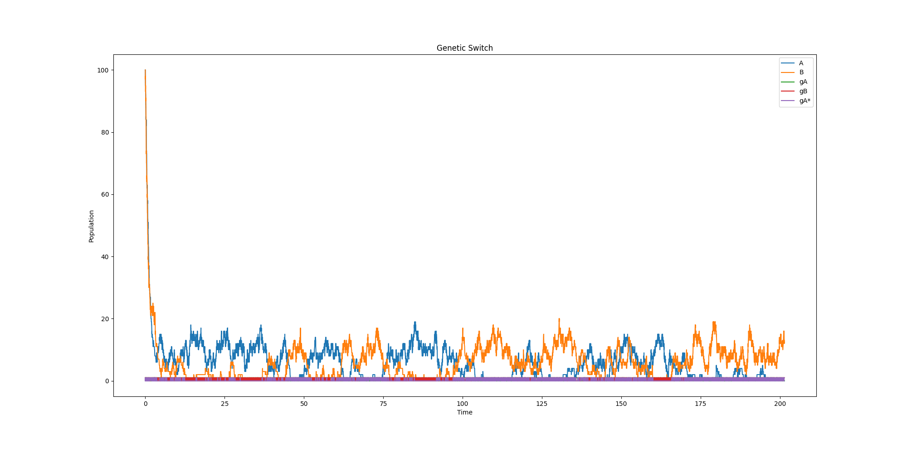

# Assignment - 3

*Python is used for this assignment.*

## Q1. Stochastic binary decisions

Gillespie’s algorithm is used to solve these problem.

<b>Fig 1: Population of A1* for 30 step simulation </b>

<b>Fig 2: Histogram of A1* Population for 30 step simulation </b>

<b>Fig 3: A1* Population for 900 step simulation </b>

<b>Fig 4: Histogram of A1* Population for 900 step simulation </b>

<b>Fig 5:Population of all species for 900 step simulation </b>

 

#### **Differnetial Rate Equations:**

dA1*/dt = k3.E.A1 .... [1]

dA1/dt = -k3.A1.E - A1.k5.S ..... [2]

dE/dt = k1.A1 +k4.A1* -kd.E ..... [3]

dS/dt = k2.A2 -kd.S .... [4]

Also k1=k2=k4=kd=1 and k3=100 and k5=100.

Looking at the above equation the rate of A1* is dependant upon the concentration of E and A1. Also the rate is always increasing and there is no destruction. Thus one expect a monotoneously increasing value of A1*. Also we expect a rapid growth of E at the begining as only -kd.E contribute to its destruction and should be low at the begining. Thus we expect a very large growth rate at the beginning but soon the rate is expected to drop as the concentration of A1 would deplete fast with the growth of S and E. We observe a similar situation in the grah.

Also we expect to observer a case where there is no growth of A1* if A1 decreases very rapidly. Then the concentration of E will reduce as well the A1 and we expect to observer almost no growth in the value of A1*. This is the numerical instability of the problem. Thuse we expect a constant value for the A1* or almost 0 very soon the simulation ater the begining of the simulation.

### **CASE-2**

*Very high value of A1 and A2*

<b>Fig 6: Population of A1* for very high value of A1 and A2 </b>

<b>Fig 7: Population of A1* for large population of A1 and A2 </b>

<b>Fig 8: Population of A1* for 30 </b>

With a very high value of A1 we don't have any instability in A1 and the value of A1 decreases smoothly following almost an exponential distribution. We expect E to have almost same behavious like previous case. Thus we expect the growth rate of A1* to be almost proportional to population of A1. Thus A1* is expected to grow for sometime and then achieve a equilibriu with near zero growth because of low population of A1. We observe similar dynamics in Figure 8.

The instability is clearly shown in the histogram of Fig 4 and Fig 7, where we expect a suddent in crease of A1* for the former case and a stable solution for the later case as depicted by Fig 7, except for the first bin we observe an equal distribution of the population.

<b> In Figure 3 and 1 the legend is A1* instesd of A1</b>

## Q2. The genetic toggle switch and stochastic bistability

The constrains:

gA+gA* = 1

gB+gB* = 1

should be followed automatically if we have correct initial value and made no mistakes defining the reactions.

The last constrain of exclusive switch was implemented by reducing the propensity of formation of gB* to 0 if gA* is present and vice-versa for gA*.

<b>Fig 9: Genetic switch for kd=1,kp=10,kf=20,kr=15</b>

As can be seen in the Fig 9, a constant switch in concentration of species A and B can be observed. 

<b>Fig 10: Genetic Switch with initial population of A and B = 100 </b>

<b>Fig 11: Genetic Switch with initial population of A and B = 1000 </b>

With a very large population of A and B we expect it to decrease very fast at the beginning and then exhibits switching between two solutions as shown in Fig 10. But if the initial condition is as high as 1000 then in terms of initial condition the hopping would be almost negligible as can be seen from Fig 11.

If one re-simulate with the exclusive switch off the fixed points are thrown off and we observe some random pattern.

<b>Fig 10: Genetic Switch with initial population of A and B = 100 </b>
